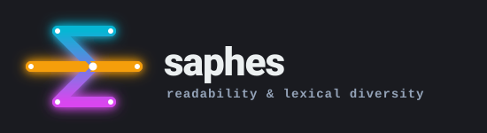

<p align="center">
  
</p>

# saphes

Readability, lexical diversity, syntactic complexity and loan-word ratio — a small set of
metrics, done carefully, with the parameters other implementations hardcode.

*saphes* — σαφής, "clear, plain, distinct". Aristotle makes clarity the chief virtue of λέξις
(style); the other classical axis is ποικιλία, variety. The package began as exactly those
two axes — **LIX measures clarity, TTR measures variety** — and has since grown a third,
**how hard a sentence is to hold in your head**, and a fourth, **how much of the vocabulary
is still felt as foreign**.

```pycon
>>> from saphes import lix
>>> result = lix("The cat sat on it. Complicated sentences generally frighten us.")
>>> result.score
45.0
>>> result.words, result.sentences, result.long_words
(10, 2, 4)

```

## Why it exists

`textstat`, `textdescriptives`, `lexicalrichness` and `taaled` already cover this ground. Two
reasons to still build it:

**The LIX long-word threshold is hardcoded at 6 everywhere.** That 6 comes from Björnsson's
Swedish original. Measured over the full Hungarian Webcorpus, **44.5% of running tokens are
"long" at threshold 6**, against **25.7%** in Swedish — so the index saturates and stops
telling texts apart. On real Hungarian prose that reads as LIX 60.4, "very difficult"; at the
calibrated threshold it reads 43.4.

**Implementations disagree**, because they count words, sentences and long words differently.
Every function here returns the counts and the parameters alongside the score, so a number
can be checked rather than trusted.

## Start here

<div class="grid cards" markdown>

- **[Tutorial](tutorial/first-measurement.md)**

    New to saphes? Measure your first text, in about ten minutes, with nothing to download.

- **[How-to guides](how-to/install.md)**

    You know what you want. Measure Hungarian text, supply a sentence count, count letters
    rather than characters, stem without a lemmatiser, calibrate a threshold.

- **[Reference](reference/index.md)**

    The machinery: every function, its contract, its failure modes, and the calibration data.

- **[Explanation](explanation/two-token-streams.md)**

    Why the metrics need different input, why the threshold has to move, and why
    implementations disagree.

</div>

## The one thing to get right

Each metric wants a **different** input, and two of them want opposites.

| Metric | Wants | Because |
|---|---|---|
| `lexical_diversity` | **lemmas** | Surface variation is noise — it measures morphology, not vocabulary. |
| `lix` | **surface forms** | Word length *is* the signal, and lemmatising erases it. |

Feed the same list to both and exactly one is silently wrong — no error, no NaN, just a
plausible number. See [The two token streams](explanation/two-token-streams.md).

`mean_dependency_distance` and `mean_hierarchical_distance` want neither: they need **head
indices**, which no tokeniser produces. Use [`saphes.adapters`](reference/adapters.md) to
convert a HuSpaCy `Doc` or a CoNLL-U file, and see [what dependency distance
measures](explanation/what-dependency-distance-measures.md). `loanword_ratio` wants lemmas,
for the same reason `lexical_diversity` does — see [why loan words need
lemmas](explanation/why-loanwords-need-lemmas.md).

If you have no lemmatiser, `unit="stem"` is a third, degraded stream — see
[Stemming is not lemmatisation](explanation/stemming-is-not-lemmatisation.md). It is declared
as its own unit rather than passed off as a lemma, so a result always says which it measured.

## Working in Hungarian

saphes is built for languages Björnsson never fitted LIX to. Hungarian gets a calibrated
threshold, a letter count that knows `sz` is one letter, and a stemmer for when no lemmatiser
is available — start at [Measure Hungarian text](how-to/measure-hungarian-text.md).

---

Made by [Crow Intelligence](https://crowintelligence.org/)
